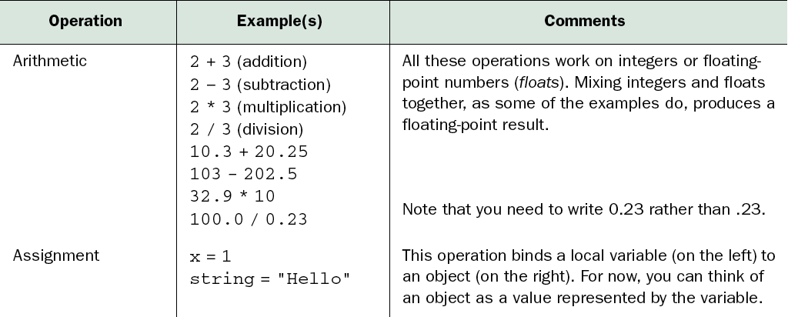
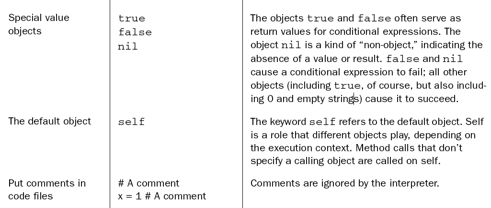

!SLIDE subsection
# Basic Ruby Literacy

# irb

    irb --simple-prompt

or

    echo "IRB.conf[:PROMPT_MODE] = :SIMPLE" >> ~/.irbrc

# Ruby syntax cheatsheet

(screengrabbed from _The Well-Grounded Rubyist_ PDF)

# Ruby identifiers

* `local_variable` - start with letter or underscore, contain letters, numbers, underscored
* `@instance_variable` - start with `@`
* `@@class_variable` - start with `@@`
* `$global_variable` - start with `$`
* `Constant` - start with uppercase letter
* `method_name?` - same as local, but can end with `?` or `!` or `=`
* keywords - about 40 reserved words (`def`) and weirdos (`__FILE__`)
* literals - `"hi"` for strings, `[1,2]` for arrays, `{:a=>1, :b=2}` for hashes

# Messages and Methods

* an object is referenced by a variable or a literal
* the dot operator (`.`) sends a message to an object
* an object receives a *message* and invokes a *method*
* with no dot, the default object (`self`) is the receiver

# Classes

* A class defines a group of behaviors (methods)
* Every object has a class, `Object` if nothing else

# `load` and `require`

* `load` inserts a file's contents into the current file
* `require` makes a *feature* available to the current file
  * skips already-loaded files
  * omits the trailing `.rb`
  * can also be used for extensions written in C (`.so`, `.dll`, etc.)

<!SLIDE subsection>
# command-line tools

# ruby

* `-w` - warnings
* `-v` - version or verbose
* `--help`
* `-c` - check syntax

# irb

# ri and rdoc

# rake

* one `Rakefile` contains many "tasks" which can be run a la `rake test`
* rake looks up the directory tree for a Rakefile
* `rake --tasks` shows all defined tasks in the current Rakefile
  * also `rake -T`

# gem

* aka RubyGems
* gem = Ruby package = library or program or plugin
* `gem install foo` - downloads and installs the "foo" gem from rubygems.org
* `gem`, `rvm` and `bundler` live in uneasy harmony

# rvm

* Ruby Version Manager
* manages lots of different versions and distros of Ruby on a single computer
  * `rvm install 1.9.2`
  * `rvm use 1.9.2`
* also manages gemsets
  * `rvm gemset create teaching`
  * `rvm use 1.9.2@teaching`

# Alex's `rvm` bash prompt:

    @@@ sh
    export Normal='\[\e[0m\]'
    export Bright='\[\e[1m\]'
    export Red='\[\e[0;31m\]'
    export Green='\[\e[0;32m\]'
    export BrightGreen='\[\e[1;32m\]'
    export PS1="\h:${Bright}\W${Normal} [${BrightGreen}\`which_ruby\`${Normal}] \u\$ "

(put the above in `~/.bash_profile`)

# bundler

* manages lots of different sets of gems and versions thereof
* bundler is a gem itself
  * `gem install bundler` loads it into the current gemset
* `bundle install`
* `bundle update`
* `Gemfile` lists all the gems for the current project (directory)
  * similar to `Rakefile` in scope

