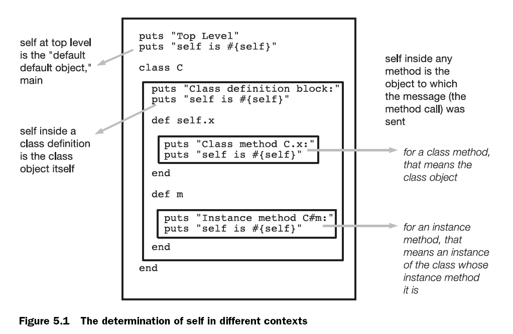

<!SLIDE subsection>
# Ruby Scope

This section covers `self` and additional scoping concerns (e.g. globals, class variables, and private/protected).

Ref.: WGR Ch. 5, The default object (self), scope, and visibility

<!SLIDE subsection>
# Identity Crisis

* All Ruby programs suffer from multiple personality disorder
* `self` is the *default message receiver*

<!SLIDE image>

<!SLIDE image>

<!SLIDE console>
# `main`, the magic self

    $ ruby -e 'puts self'
    main

Methods defined inside main become *private* methods of *`Object`*

# `self` in class and module definitions

    @@@ ruby
    class C
      puts self    # "C"
      module M
        puts self  # "C::M"
      end
      puts self    # "C"
    end

# `self` during class methods definitions

* This allows the fun trick `def self.foo` to define class methods
* Easier to identify class methods, also easier to rename your class

# `self` in method definitions

* This is weird if you think about it too hard
* When the interpreter hits a `def`, it *defines* the method immediately but doesn't *execute* it until later
* When it's executed, `self` is pointing to the *instance* the method was called on

        @@@ ruby
        class C
          def x
            puts self
          end
        end

        >> C.new.x
        #<C:0x0000010087e898>

# `self` in instance methods

    @@@ ruby
    class C
      def x
        puts "x"
      end
      
      def y
        puts "y"
        self.x   # << same
        x        # << thing
      end
    end

# The setter gotcha

* Inside an object, you can't call that object's setter methods directly
* Why not?
  * Because "`age = 2`" looks like a *local variable* assignment, which takes precedence
  * It _eclipses_ the setter method!
  * Syntax ambiguity! Oh noes!
* Solution: use "`self.age = 2`"

# An Elegant Object, using implicit self

    @@@ruby
    class Student
      attr_accessor :first_name, :middle_name, :last_name

      def initialize first_name, middle_name, last_name
        @first_name, @middle_name, @last_name = 
          first_name, middle_name, last_name
      end
  
      def name        
        name = "" 
        name << first_name
        name << " #{middle_name}" if middle_name
        name << " #{last_name}"   # returns name
      end
    end

# Digging into the name method

    @@@ruby
    >> Student.new("alex", "day", "chaffee").name
    => "alex day chaffee"
    
    >> Student.new("alex", "", "chaffee").name
    => "alex  chaffee"
    
    >> Student.new("alex", nil, "chaffee").name
    => "alex chaffee"
    
<!SLIDE subsection>
# Global and Class Variable Scope

# Global Variables

* start with `$`
* available everywhere
* Danger!

# Built-in Global Variables

* `$:` load path (also `$LOAD_PATH`)
* `$*` command-line args (also `ARGV`)
* `$$` pid
* `$!` the most recent shell error
* for more, open English.rb in the Ruby source
  * `$HOME/.rvm/src/ruby-1.9.2-*/lib/English.rb`

# Class Variables

* start with `@@`
* really "class *and* instance *and* descendants" variables
* available inside class definitions **and** instance methods
* used for counters, caches, etc.

# Class Variable Problems

* must be initialized before access (unlike instance vars)
* very widely shared, so easily polluted
* can be replaced with *class instance variables*
  * single-`@` vars inside class methods

<!SLIDE subsection>
# Method Scope (Public/Protected/Private)

# private methods
* declared with `private` keyword
* only accessible to that specific instance
  * i.e. from inside an instance method of that class
  * i.e. when `self` is the receiving object
  
# you can't even access your siblings' private parts

    @@@ ruby
    class Midas
      def initialize(initial_gold)
        @gold = initial_gold
      end
  
      def gold
        @gold
      end

      def take_gold_from(other)
        @gold += other.gold
      end
  
      private :gold
    end

    >> m1 = Midas.new(10)
    >> m2 = Midas.new(20)
    >> m1.take_gold_from(m2)
    NoMethodError: private method `gold' called

# protected methods

* available when `self` is an instance of that class or one of its descendants

        @@@ruby
        class Midas
          protected :gold
        end
    
        m1.take_gold_from(m2)
        => 30

# scoping toggles

* `private`, `protected`, and `public` without arguments turn scoping on or off
* all *upcoming* methods assume that scope, until another scope is set, or the class definition ends
* this is the normal way to mark methods' scope

# weird top-level scope

## (advanced topic)

1. methods defined outside any class or module become *private methods on `Object`* and are available everywhere
2. private methods defined inside the `Kernel` are also available everywhere

`require`, `load`, `raise` etc. are Kernel methods

    @@@ruby
    ruby -e 'print Kernel.private_instance_methods(false)'

