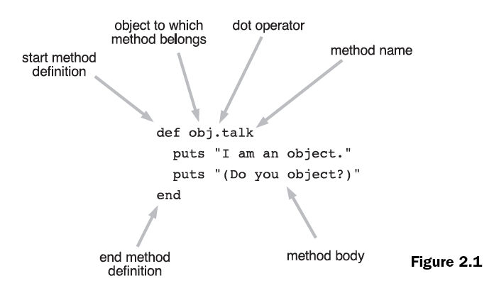

<!SLIDE subsection>
# Ruby Objects

This section introduces Ruby's object-oriented programming model, including instances, methods, parameters, and memory management (instances and references). Later sections cover *classes* and *modules* and further topics.

Ref: WGR Chapter 2. Objects, methods, and local variables

Note: Following WGR's lead, in this section we define methods on instances (not on classes), to keep the lessons simple.

# What is an object?

<!SLIDE incremental>
# What is an object?

* An object encapsulates state and behavior.

  * *encapsulate* - put like things together; keep unlike things apart

  * *state* - data, variables, properties, attributes, constants

  * *behavior* - methods
  
<!SLIDE incremental>
# The Linugistic Metaphor for Objects

One way to think about objects: 

Objects are *things* that can be *described* and can *do* things, or...

  * Objects are nouns
  * Methods are verbs
  * Attributes are adjectives
  * Classes are categories


# Objects vs. Classes

* objects are more fundamental than classes
* in Ruby, you can add behavior to an object directly
* class inheritance is complicated
  * we'll cover it later

# Creating an object

    @@@ ruby
    cookie = Object.new

* now `cookie` refers to an object *instance*
  * unique storage location in memory
  * *instance data* stored in that location

# Creating an object *literally*

    @@@ ruby
    fruit = "apple"

* `"apple"` is a *string literal*
* `fruit` now refers to a new object *instance*

# References and Instances

* Imagine computer memory with two compartments: *references* and *instances*
  * also known as "the stack" (or "the scope") and "the heap"
* References include *parameters* and *local variables*
* Instances contain the "real" data
* Each reference points at the location of an instance
  * every reference is the same size (just 32 bits, or maybe 64 bits)

| Stack |     | Heap    |
| ----- | --- | -----   |
| fruit | ->  | "apple" |

# Literals create instances

    @@@ ruby
    fruit = "apple"
    dessert = "apple"

* `fruit` refers to a new object *instance*
* `dessert` refers to a *different*, new object instance

| Stack |     | Heap  |
| ----- | --- | ----- |
| fruit | ->  | "apple" |
| dessert | ->  | "apple" |

# References are independent of instances

    @@@ ruby
    fruit = "apple"
    dessert = fruit
    fruit = "banana"
    dessert = fruit

What are the values of `fruit` and `dessert` after each line?

# Object Identity

How can you tell if two references point to the same instance?

    @@@ ruby
    fruit = "apple"
    dessert = "apple"
    >> fruit.object_id
    => 2165091560
    >> dessert.object_id
    => 2165084200

Ref. WGR Ch.2, Section 2.3.1

# Object Equality

* Many ways to compare objects
  * `==` params are equal (overridable)
  * `.eql?` params are equal *and* the same type
  * `.equal?` params are identical (same `object_id`)
* `==` is usually what you want

Note that `.equal?` is not guaranteed since bizarrely, some objects override `.equal?` to do something else. If you really want to know if two variables reference the same instance, compare their `object_id`s.

# Garbage Collection

    @@@ ruby
    fruit = "apple"
    fruit = "banana"

* Now the instance containing "apple" is *unreferenced*
* So it can (and eventually will) be *garbage collected*

# Side effects

* a variable is a *reference* to an *instance* (persistent location in memory)
* if you have several references to the same instance, odd things can happen

        @@@ ruby
        friend = "Alice"
        teacher = friend
        friend.upcase!
        teacher
        => "ALICE"

!SLIDE subsection
# Behavior

# Defining methods

    @@@ ruby
    cookie = Object.new

    def cookie.bake
      puts "the oven is nice and warm"
    end

* bake is a *method*
  * aka function, procedure, subroutine
* `def cookie.` ("def cookie dot") means "define a method *on* cookie"

# Invoking methods

Behavior comes from *messages* and *methods*.

    @@@ ruby
    cookie.bake

prints `I'm a cookie` to the console

* the object `cookie` receives the message `bake` and executes the method `bake`
* dot (`.`) is the *message operator*

!SLIDE
# Method Definition Schematic


Ref. _The Well-Grounded Rubyist_ PDF, Fig. 2.1

# The `methods` method

    @@@ ruby
    >> cookie.methods
    => [:nil?, :===, :=~, :!~, :eql?, ...]
    >> cookie.methods(false)
    => [:bake]

also useful: `cookie.methods.sort`, `cookie.methods.grep(/age/)`

    >> cookie = Object.new
    => #<Object:0x007f86e485c3a8>
    >> cookie.methods(false)
    => []
    >> def cookie.bake; puts "hi"; end
    => nil
    >> cookie.methods(false)
    => [:bake]

    >> "goo".methods.grep(/sub/)
    => [:sub, :gsub, :sub!, :gsub!]

# The `respond_to?` method

    @@@ ruby
    if cookie.respond_to? :bake
      cookie.bake
    else
      puts "cookie is unbakable"
    end
    
Note: Usually you don't use `respond_to` because of *duck typing*.

!SLIDE subsection
# State

# Instance variables are stored in the object

    def cookie.add_chips(num_chips)
      @chips = num_chips
    end

    def cookie.yummy?
      @chips > 100
    end

    cookie.add_chips(500)
    cookie.yummy?   #=> true

# Self

* All OO programs suffer from multiple personality disorder
* `self` is the *default message receiver*
* `self` is set *invisibly* to always point to the *current object*

# Self Example

```
@@@ruby
def cookie.yummy?
  @chips > 100
end

def cookie.add_chips(num_chips = 10)
  @chips 
  @chips += num_chips
end

def cookie.yummify
  add_chips until yummy?
end
```

* inside `yummify` the call to `yummy?` goes to `self`


