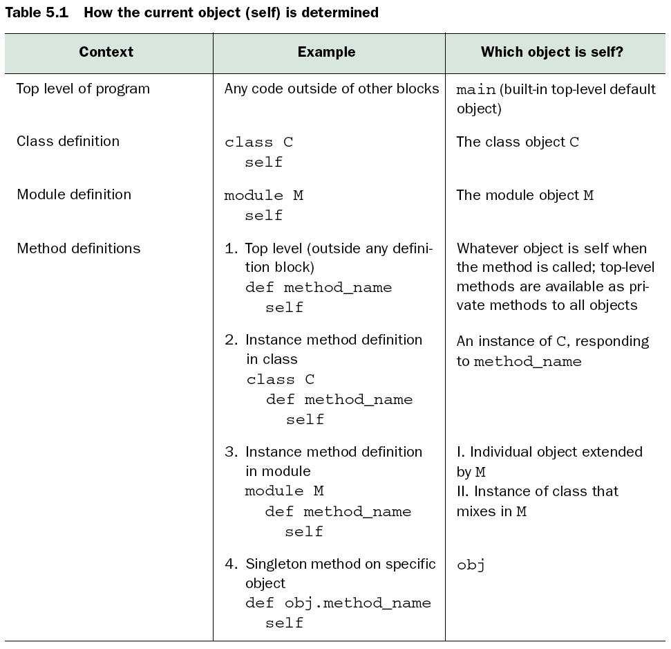

<!SLIDE subsection>
# Self

Ref.: WGR Ch. 5, The default object (self), scope, and visibility

<!SLIDE subsection>
# Who Am I?

* All Ruby programs suffer from multiple personality disorder
* `self` is the *default message receiver*

<!SLIDE image>

<!SLIDE image>

<!SLIDE console>
# `main`, the magic self

    $ ruby -e 'puts self'
    main

Methods defined inside main become *private* methods of *`Object`*

# `self` in method definitions

* This is weird if you think about it too hard
* When the interpreter hits a `def`, it *defines* the method immediately but doesn't *execute* it until later
* When it's executed, `self` is pointing to the *instance* the method was called on

        @@@ ruby
        class C
          def x
            puts self
          end
        end

        >> C.new.x
        #<C:0x0000010087e898>

# `self` in instance methods

    @@@ ruby
    class C
      def x
        puts "x"
      end
      
      def y
        puts "y"
        self.x   # << same
        x        # << thing
      end
    end

# `self` in class and module definitions

    @@@ ruby
    class C
      puts self    # "C"
      module M
        puts self  # "C::M"
      end
      puts self    # "C"
    end

# `self` during class methods definitions

* This allows the fun trick `def self.foo` to define class methods
* Easier to identify class methods, also easier to rename your class
